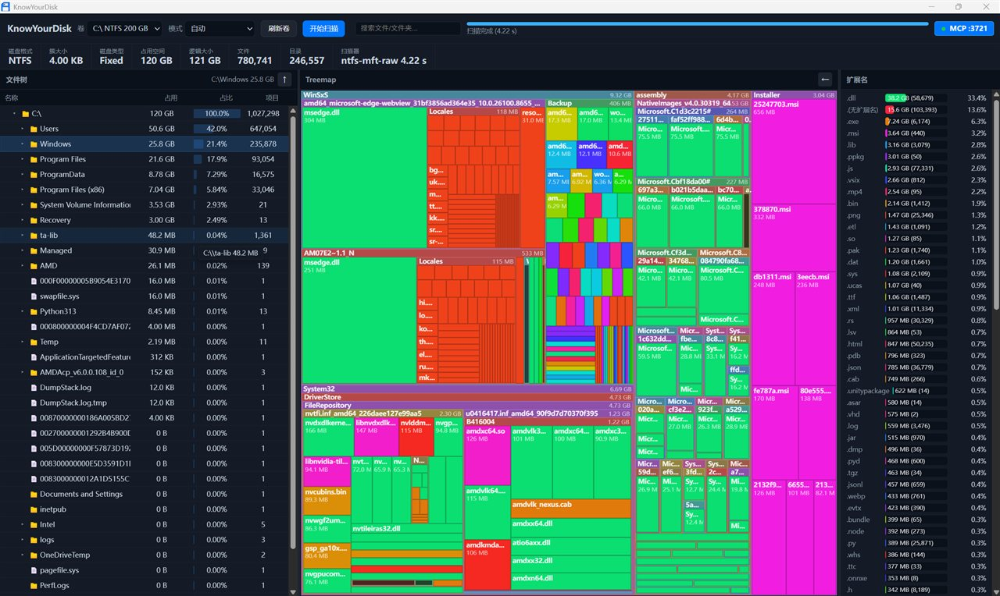

# KnowYourDisk

> WizTree-inspired high-speed disk space analysis and visualization, with a built-in MCP server for AI coding assistants



## Features

- **NTFS MFT Direct Scan** — Parses raw `$MFT` records for near-instant results
- **Walkdir Fallback** — Compatible recursive scan mode for non-NTFS volumes
- **Treemap Visualization** — Squarified layout canvas rendering
- **File Tree** — Virtual-scrolled expandable directory browser
- **Extension Stats** — Aggregated size distribution by file type
- **File Search** — Real-time filename search with debounced input
- **MCP Server** — Integrates with AI coding assistants via Model Context Protocol
- **Auto Elevation** — Requests admin privileges at startup, falls back to non-admin if cancelled

## Tech Stack

- **Frontend**: TypeScript + Vite + Vanilla TypeScript
- **Backend**: Rust + Tauri v2
- **NTFS Parsing**: Pure Rust, no external NTFS dependencies
- **MCP Server**: Standalone Axum HTTP SSE service

## Development

```bash
npm run dev
```

## Build

### Desktop App

```bash
npm install
npm run build
```

During `dev` or `build`, the MCP binary is automatically compiled and copied to `src-tauri/binaries/`, bundled into the final installer.

### Build MCP Server Only (Standalone)

Build the standalone MCP server binary for use outside the Tauri app:

**Debug:**
```bash
cargo build -p fastscan-mcp
# Output: target/debug/fastscan-mcp.exe
```

**Release:**
```bash
cargo build -p fastscan-mcp --release
# Output: target/release/fastscan-mcp.exe
```

The MCP server runs in HTTP SSE mode by default, listening on `127.0.0.1:3721` (port configurable via `--port`).

> **Note:** The legacy stdio transport code is still present in the source tree (`server_stdio.rs`). If you need subprocess-based MCP launching, refer to the Claude Code stdio example below and re-enable it at compile time.

## MCP Server

The built-in MCP server (`fastscan-mcp`) exposes disk analysis tools via [Model Context Protocol](https://modelcontextprotocol.io), enabling AI coding assistants to scan volumes, browse directories, search files, and analyze disk usage.

### Tools

| Tool | Description |
|------|-------------|
| `list_volumes` | List all disk volumes with capacity and filesystem info |
| `scan_disk` | Deep scan a disk volume (NTFS MFT requires admin; auto-falls back to walkdir) |
| `scan_status` | Get a summary of the current scan results |
| `browse_directory` | Get children of a directory node |
| `get_node_path` | Get the full path of a file/directory node |
| `get_node_details` | Get a node and all its ancestor nodes (breadcrumb navigation) |
| `search_files` | Search files/directories by name (with optional filters) |
| `get_extension_stats` | Get file extension statistics from the last scan |
| `get_treemap` | Get treemap visualization data for a directory |
| `get_largest_files` | Get the largest files from the last scan |
| `get_largest_directories` | Get the largest directories from the last scan |
| `find_empty_directories` | Find empty directories |
| `find_duplicate_files` | Find duplicate files by name and size |
| `find_files_by_age` | Find files by modification time |

### Usage

```bash
# Default (HTTP SSE mode, port 3721)
fastscan-mcp

# Custom port
fastscan-mcp --port 8080
```

On startup, a UAC prompt will request administrator privileges. If cancelled, the server continues in non-admin mode, but NTFS MFT fast scanning will be unavailable.

The HTTP mode can also be toggled via the in-app MCP start/stop button or tray icon right-click menu.

## MCP Host Configuration

HTTP SSE configuration examples for connecting FastScan MCP server to MCP-compatible AI coding assistants. Start `fastscan-mcp` first (default listen on `127.0.0.1:3721`), then configure the host to connect to its URL.


---

### VS Code (GitHub Copilot)

**Config file:** `.vscode/mcp.json` (workspace-level, uses `"servers"` key, not `"mcpServers"`)

```jsonc
{
  "servers": {
    "fastscan": {
      "type": "http",
      "url": "http://127.0.0.1:3721/sse"
    }
  }
}
```

---

### Claude Desktop

**Config file:** `%APPDATA%\Claude\claude_desktop_config.json`

```jsonc
{
  "mcpServers": {
    "fastscan": {
      "transport": "sse",
      "url": "http://127.0.0.1:3721/sse"
    }
  }
}
```

---

### Claude Code (CLI)

**Config file:** `.mcp.json` (project-level) or `~/.claude.json` (user-level)

**HTTP** (recommended, or add via CLI):
```bash
claude mcp add --transport sse fastscan http://127.0.0.1:3721/sse
```
Or in config file:
```jsonc
{
  "mcpServers": {
    "fastscan": {
      "type": "http",
      "url": "http://127.0.0.1:3721/sse"
    }
  }
}
```

**stdio** (legacy mode, requires recompilation):
> The stdio transport implementation is preserved in `server_stdio.rs`. If you need subprocess-based MCP launching, refer to this config and recompile with stdio support.Replace with the actual installation path.
```jsonc
{
  "mcpServers": {
    "fastscan": {
      "command": "D:\\KnowYourDisk\\binaries\\fastscan-mcp.exe"
    }
  }
}
```

---

### OpenCode

**Config file:** `opencode.json` (project root)

```jsonc
{
  "$schema": "https://opencode.ai/config.json",
  "mcp": {
    "fastscan": {
      "type": "remote",
      "url": "http://127.0.0.1:3721/sse",
      "enabled": true
    }
  }
}
```

---

### Codex CLI (OpenAI)

**Config file:** `~/.codex/config.toml`

```toml
[mcp_servers.fastscan]
url = "http://127.0.0.1:3721/sse"
```

Or via CLI:
```bash
codex mcp add fastscan -- D:\\KnowYourDisk\\binaries\\fastscan-mcp.exe
```

---

### Cursor

**Config file:** `.cursor/mcp.json` (project-level) or `~/.cursor/mcp.json` (user-level)

```jsonc
{
  "mcpServers": {
    "fastscan": {
      "url": "http://127.0.0.1:3721/sse"
    }
  }
}
```

Also configurable via Cursor settings UI (Features > MCP > Add New MCP Server).

---

### Config File Locations

| Host | Config File | Root Key |
|------|------------|----------|
| VS Code | `.vscode/mcp.json` | `servers` |
| Claude Desktop | `%APPDATA%\Claude\claude_desktop_config.json` | `mcpServers` |
| Claude Code | `.mcp.json` / `~/.claude.json` | `mcpServers` |
| OpenCode | `opencode.json` | `mcp` |
| Codex CLI | `~/.codex/config.toml` | `[mcp_servers.*]` |
| Cursor | `.cursor/mcp.json` / `~/.cursor/mcp.json` | `mcpServers` |
